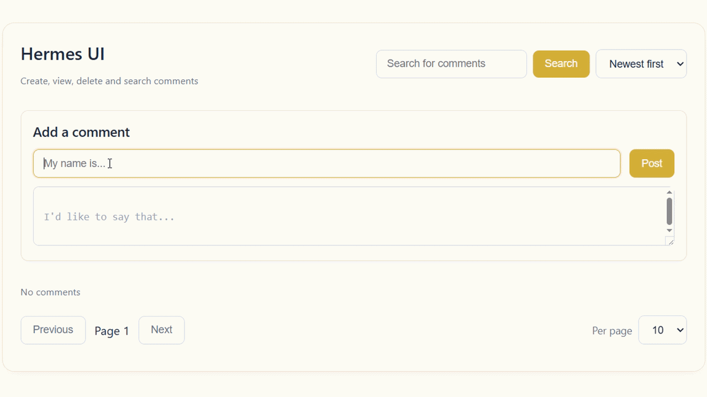

<h3 align="center">Hierarchical comment service with PostgreSQL persistence, Ginext API, nested threads, and structured error handling.</h3>

## 



<br>

## Table of Contents

- [Architecture](#architecture)
- [Installation](#installation)
- [Configuration](#configuration)
- [Shutting down](#shutting-down)
- [API](#api)
- [Validation](#validation)
- [Request examples](#request-examples)

<br>

## Architecture

- **App** — the central orchestrator of the system.  
  Responsible for application bootstrap and lifecycle management. It loads configuration, initializes logger and database, wires all components (storage, service, handler, server) together, and controls startup and graceful shutdown using a shared context.

- **Server** — the HTTP server layer.  
  Configurable Ginext-based server with read/write timeouts, header limits, and graceful shutdown support.

- **Handler** — HTTP request processing layer.  
  Registers API v1 routes, serves the static web frontend at /, and dispatches requests to the service layer.

- **Service** — the application-level business logic layer.  
  Performs validation, orchestrates repository calls, builds hierarchical comment trees, and handles error mapping.

- **Storage** — the persistent data layer and source of truth (PostgreSQL).  
  Implements all CRUD operations for comments, supports nested threads, and returns flat or hierarchical comment structures.


<br>

## Installation
⚠️ Note: This project requires Docker Compose, regardless of how you choose to run it. 

First, clone the repository and enter the project folder:

```bash
git clone https://github.com/Pur1st2EpicONE/Hermes.git
cd Hermes
```

Then you have two options:

#### 1. Run everything in containers
```bash
make
```

This will start the entire project fully containerized using Docker Compose.

#### 2. Run Hermes locally
```bash
make local
```
In this mode, only PostgreSQL is started in a container, while the application itself runs locally.

⚠️ Note:
Local mode requires Go 1.25.1 and the latest version of the migrate CLI tool installed on your machine.

<br>

## Configuration

### Runtime configuration

Hermes uses two configuration files, depending on the selected run mode:

[config.full.yaml](./configs/config.full.yaml) — used for the fully containerized setup

[config.dev.yaml](./configs/config.dev.yaml) — used for local development

You may optionally review and adjust it to match your preferences. The default values are suitable for most use cases.

### Environment variables

Sensitive credentials are loaded from a .env file. If environment file does not exist, .env.example is copied to create it. If environment file already exists, it is used as-is and will not be overwritten.

⚠️ Note: Keep .env.example for local runs. Some Makefile commands rely on it and may break if it's missing.

<br>

## Shutting down

Stopping Hermes depends on how it was started:

- Local setup — press Ctrl+C to send SIGINT to the application. The service will gracefully close connections and finish any in-progress operations.  
- Full Docker setup — containers run by Docker Compose will be stopped automatically.

In both cases, to stop all services and clean up containers, run:

```bash
make down
```

⚠️ Note: In the full Docker setup, the log folder is created by the container as root and will not be removed automatically. To delete it manually, run:
```bash
sudo rm -rf <log-folder>
```

⚠️ Note: Docker Compose also creates a persistent volume for PostgreSQL data (hermes_postgres_data). This volume is not removed automatically when containers are stopped. To remove it and fully reset the environment, run:
```bash
make reset
```

<br>

## API

All endpoints are mounted under /api/v1. The root path / serves a clean web frontend with comment submission form. Responses follow this convention:

- Success: **200 OK** with JSON body **{"result": \<value>}**
- Error: appropriate status code with JSON body **{"error": "\<message>"}**


<br>

### Create comment

```bash
POST /api/v1/comments
```

Request body examples:
```json
{
    "content": "Chainsaw Man's ending fucking sucks!",
    "author": "Abobus69"
}
```

```json
{
    "parent_id": 123, 
    "content": "it does",
    "author": "Tatsuki Fujimoto"
}
```

**parent_id** (integer, optional) Parent comment ID for nested threads

**content** (string, required) Comment text

**author** (string, required) Name of the commenter


<br>

On success, the API returns 200 OK and comment's identifier. Example:

```json
{
    "result": 124
}
```

Typical error responses

- **400 Bad Request** — invalid JSON, validation failures.
- **404 Not Found** — parent comment does not exist.
- **500 Internal Server Error** — all internal failures.

<br>

### Get comments

```bash
GET /api/v1/comments?parent=<id>&page=1&limit=20&sort=created_at_desc
```

Query parameters: 

**parent** (integer, optional) — root comment ID.
**page** (integer, optional) — Pagination, default 1.
**limit** (integer, optional) — Pagination, default 20, max 100.
**sort** (string, optional) — Sorting option: created_at_desc or created_at_asc.

<br>

On success, the API returns 200 OK and all requested comments:

```json
{
  "result": [
    {
      "id": 123,
      "parent_id": null,
      "content": "Chainsaw Man's ending fucking sucks!",
      "author": "Abobus69",
      "created_at": "2026-03-29T20:00:00Z",
      "updated_at": "2026-03-29T20:00:00Z",
      "children": [
        {
          "id": 124,
          "parent_id": 123,
          "content": "it does",
          "author": "Tatsuki Fujimoto",
          "created_at": "2026-03-29T20:01:00Z",
          "updated_at": "2026-03-29T20:01:00Z"
        }
      ]
    }
  ]
}
```

<br>

### Delete comment

```bash
DELETE /api/v1/comments/:id
```

On success, returns:

```json
{
  "result": "deleted"
}
```

<br>

## Validation

**content** — cannot be empty.

**author** — cannot be empty.

**parent_id** — must refer to an existing comment (if provided).

<br>

## Request examples

⚠️ Note: When the service is running, a clean web-based UI is available at http://localhost:8080. The examples below show direct API usage with curl.

### Create root comment

```bash
curl -X POST http://localhost:8080/api/v1/comments \
  -H "Content-Type: application/json" \
  -d '{"content": "This is the root comment", "author": "C00lGuy"}'
```

### Response

```json
{
  "result": 1
}
```

<br>

### Reply to comment

```bash
curl -X POST http://localhost:8080/api/v1/comments \
  -H "Content-Type: application/json" \
  -d '{"parent_id": 1, "content": "This is a reply to C00lGuy", "author": "SmartFella"}'
```

### Response

```json
{
  "result": 2
}
```

<br>

### List root comments (with nested replies)

```bash
curl http://localhost:8080/api/v1/comments?page=1&limit=10
```

### Response

```json
{
  "result": [
    {
      "id": 1,
      "parent_id": null,
      "content": "This is the root comment",
      "author": "C00lGuy",
      "created_at": "2026-03-29T20:00:00Z",
      "updated_at": "2026-03-29T20:00:00Z",
      "children": [
        {
          "id": 2,
          "parent_id": 1,
          "content": "This is a reply to C00lGuy",
          "author": "SmartFella",
          "created_at": "2026-03-29T20:01:00Z",
          "updated_at": "2026-03-29T20:01:00Z"
        }
      ]
    }
  ]
}
```

<br>

### Delete comment

```bash
curl -X DELETE http://localhost:8080/api/v1/comments/2
```

### Response

```json
{
  "result": "deleted"
}
```
